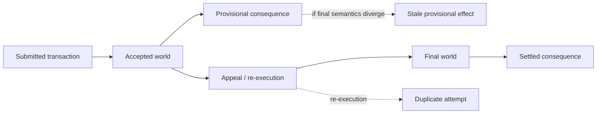

# EXP-003 Visualizations

The visual layer must distinguish **protocol observations**, **application consequences**, and **apparatus validity**. A failed CI run is not plotted as a failed protocol outcome.

## 1. World-transition timeline

Purpose: show the core object of EXP-003 — one shared world becoming actionable before it is settled.



Interpretation:
- `Accepted world` means recognized shared state during the finality window.
- `Final world` means the adjudicated state after the relevant appeal/finality process.
- The dotted branches are hypotheses to measure, not guaranteed behavior.

## 2. Consequence attempts by timing policy

Chart: grouped bars.

X-axis: run/case.

Series:
- provisional sink attempts;
- settled sink attempts.

Question answered:
> How much downstream execution is exposed to provisional state compared with finalized state?

Do not render missing evidence as zero.

## 3. Duplicate delta after appeal

Chart: grouped bars.

Series:
- `provisional_duplicate_delta`;
- `settled_duplicate_delta`.

Question answered:
> Does re-execution create additional delivery pressure, and is that pressure concentrated in accepted-timing effects?

A zero duplicate delta is a valid and important result.

## 4. Finality latency distribution

Chart: scatter or box/violin in an external notebook; scatter is sufficient in the repository-native view.

X-axis: run sequence.
Y-axis: `finality_latency_ms`.

Optional encoding: case type (`EXP-003A` vs `EXP-003B`).

Question answered:
> What latency premium does the application pay to condition consequences on finalized rather than accepted state?

## 5. Provisional/final semantic matrix

For EXP-003B, classify valid cases by independently evidenced semantic state:

| Accepted semantics | Final semantics | Interpretation |
|---|---|---|
| positive | positive | stable positive world |
| positive | negative | semantic overturn candidate |
| negative | negative | stable negative world |
| negative | positive | reverse overturn; separate case family if observed |

A `positive → negative` cell is not enough to label a stale consequence. The seven-part stale-world evidence gate in `DATASET.md` must also pass.

## 6. Consequence stability vector

Rather than prematurely collapse observations into one score, show a radar/spider chart or small multiples externally for:

- finality latency;
- duplicate rate;
- stale effect rate;
- compensation cost;
- reversibility.

Repository-native reports should prefer small multiples because scales differ and radar charts can visually overstate weak measurements.

## 7. Apparatus validity

Chart: stacked bar by network/toolchain revision.

Categories:
- `VALID_RUN`;
- `INVALID_RUN`;
- `NO_RESULT`.

Question answered:
> Is the benchmark apparatus itself becoming reliable enough that protocol conclusions are warranted?

This graph is methodological evidence, not GenLayer performance evidence.

## Recommended first report layout

```text
┌─────────────────────────────────────────────────────────────┐
│ CFYOW Shared Consequence Benchmark — EXP-003               │
├─────────────────────────────────────────────────────────────┤
│ World-transition timeline                                  │
├──────────────────────────────┬──────────────────────────────┤
│ Provisional vs settled       │ Duplicate delta after appeal │
│ consequence attempts         │                              │
├──────────────────────────────┼──────────────────────────────┤
│ Finality latency             │ Semantic transition matrix   │
├──────────────────────────────┴──────────────────────────────┤
│ Apparatus validity + network/toolchain provenance           │
└─────────────────────────────────────────────────────────────┘
```

## Visualization integrity

Every quantitative point must resolve to a committed dataset row and, transitively, to raw network/sink evidence. Illustrative diagrams must be labeled as conceptual and must not use numeric values that look measured.
